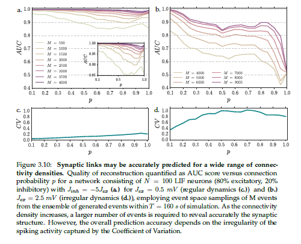
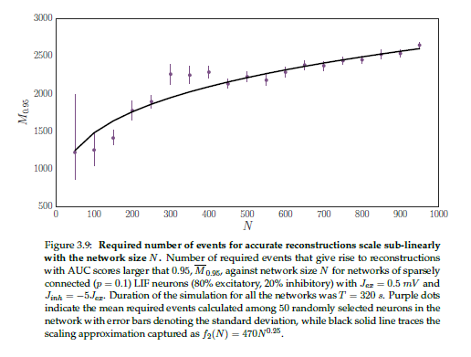
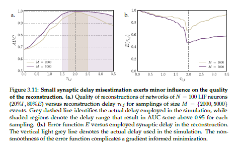
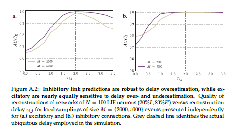
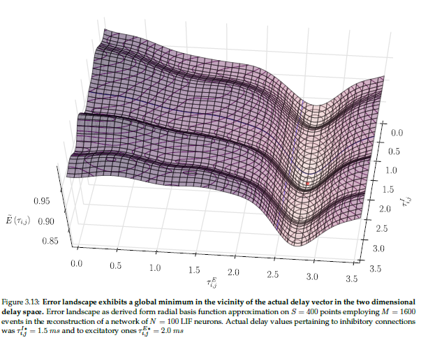
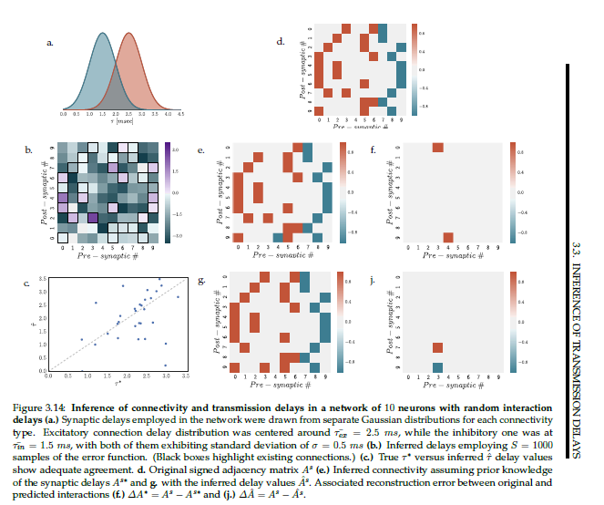

# Inferring synaptic interactions and transmission delays

(old project - to be archived ) 

[under construction - more details soon - brief info on the poster I presented at BCCN 2016 [here](https://gitlab.com/di.ma/inferring-synaptic-interactions-and-transmission-delays/-/blob/master/poster-connectomics_through_nonlinear-1.png) and (only for the synaptic inference part) see the published article [here](https://gitlab.com/di.ma/Connectivity_from_event_timing_patterns/-/blob/master/PhysRevLett.121.054101.pdf)]

